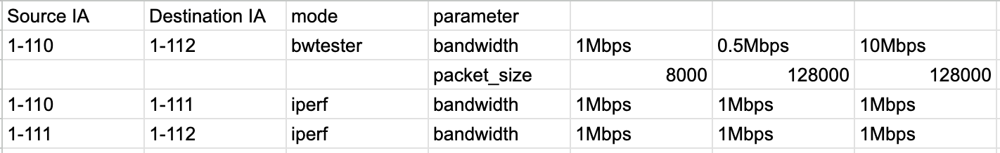

## Installation Instructions

### Introduction

This project is a simple traffic generator that allows to generate traffic on top of a [seed-emulator](https://github.com/seed-labs/seed-emulator) emulation.

**Requirements:**
- python3 
- pip version 24.0 or higher
- docker
- docker compose
- seedemu

**install Requirements:**

``bash
pip install -r requirements.txt
``
## Usage

To use the traffic generator you need two basic components. Firstly you will need to have a seed emulation. Secondly you will need to have a pattern file.

1. The seed emulation should be dumped to a file (`seed.bin` in this example) using the `emu.dump()` function
2. The traffic pattern pattern specififes how the traffic should be generated. An example pattern file can be found in the `pattern_sample.json` file. Alternaticely one can also specify traffic using a traffic matrix this allows modulating traffic parameters such as bandwidth to be modulated over time. Check out the [Traffic Matrix](#Traffic-Matrix) section for more information.

``bash
python3 traffic_gen.py 
``

Here's the converted text in markdown format:

### Optional arguments:

* `-h, --help`  : Show this help message and exit
* `-p PATTERN_FILE, --pattern_file PATTERN_FILE`  : The pattern file
* `-w WAIT_FOR_UP, --wait_for_up WAIT_FOR_UP`  : The time to wait for containers to be ready
* `-s SEED_FILE, --seed_file SEED_FILE`  : 
    The seed bin file to use for emulation. You can obtain this by using
    `emu.dump()` before rendering a seed emulation
* `-b, --skip_build`  : Skip the Build process. This can be helpful if you want to run several
    generations back to back. Note that some changes such as adding sig option to
    patterns require rebuilding
* `-l LOGDIR, --logdir LOGDIR`  : The directory to store logs
* `-m TRAFFIC_MATRIX, --traffic_matrix TRAFFIC_MATRIX`  : The traffic matrix file
* `-ts TIME_STEP, --time_step TIME_STEP`  : The time step for the traffic matrix
* `-c SEED_COMPILED_DIR, --seed_compiled_dir SEED_COMPILED_DIR`  : The directory to store the compiled seed emulation
* `-cw CUSTOM_WEBPAGES, --custom_webpages CUSTOM_WEBPAGES`  : The file containing a list of webpages to clone
* `-wd WEBPAGE_DIR, --webpage_dir WEBPAGE_DIR`  : The directory to clone the webpages to


### Patterns

A pattern file such as the `pattern_sampl.json` is used to specify the traffic generation parameters. It consists of a list of patterns which have the following structure:
    
```
{
    "traffic_patterns": [
      {
        "start_offset": "0m",
        "source": "1-110",
        "destination": "1-112",
        "mode": "bwtester",
        "specialized_parameters": {
          "cs": "10,?,?,10Mbps",
          "sc": "10,?,?,500kbps"
        }
      },    
      {
        "start_offset": "10s",
        "source": "1-110",
        "destination": "1-112",
        "mode": "bwtester",
        "parameters": {
          "duration": 30,
          "bandwidth": "10Mbps"
        }
      },
    {
        "start_offset": "10s",
        "source": "1-110",
        "destination": "1-111",
        "mode": "iperf",
        "sig": true,
        "parameters": {
          "duration": 30,
          "bandwidth": "10Mbps"
        }
      }
    ]
}
```

- `start_offset`: The time at which the pattern should start after the generation begins. This can be specified in seconds or minutes or hours. For example `10s` or `5m`
- `source`,`destination`: The source of the traffic. This is an ISD-AS pair such as `1-110` which denotes ISD 1 and AS 110
- `mode`: The mode of the traffic generation. Currently supported are `bwtester`, `iperf`, `web`
- `specialized_parameters`: The specialized parameters for the traffic generation. This is specific to the mode. For example for `bwtester` some of the parameters are `cs` and `sc` which denote the client to server and server to client bandwidths respectively. But here any cmd line arguments supported by the respective tool can be specified
- `parameters`: The parameters for the traffic generation. This can be used for every mode and supports `bandwidth`,`packet_size` and `duration`. Thought the web mode only supports `duration` as the other two do not really make sense here
- Additionally there is a `sig` parameter which can be used to specify if the traffic should be generated using the sig tool. This is only supported for the `iperf` and `web` modes as these are the only IP based modes


### Traffic-Matrix

Traffic Matrix is a way to specify traffic generation using a matrix. This allows for more complex traffic patterns to be generated. The matrix is specified in a csv file where each row corresponds to a pair of ASes and each collumn corresponds to a timestep. Timesteps can be set dynamicially the default is **10s**

An Example of a traffic matrix is shown below and in the `TrafficMatrix.csv` file:




This Traffic Matrix will be translated into a pattern file and then used to generate traffic.